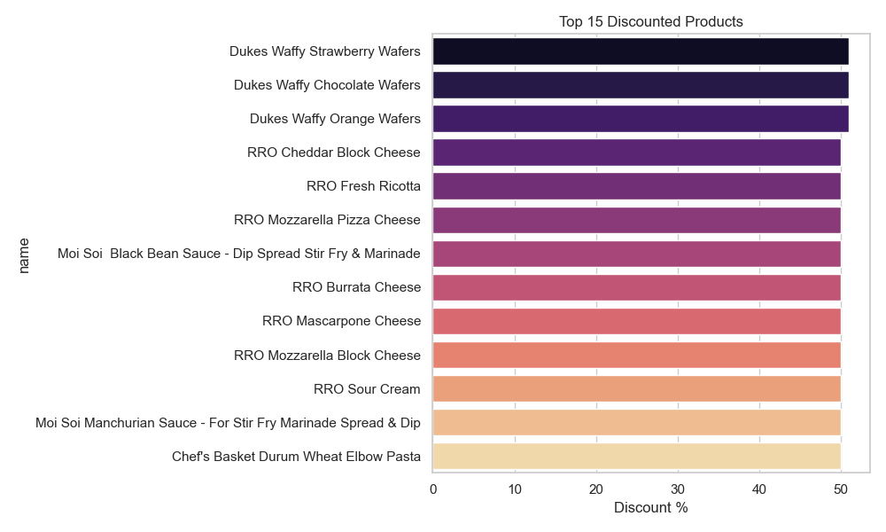
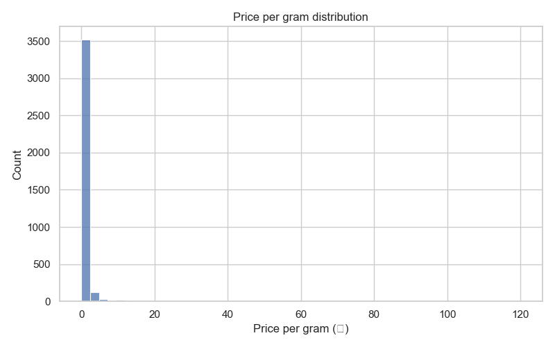

# Zeptalytix — Zepto SQL Analytics Pipeline

End-to-end Zepto e-commerce data analysis project using SQL, Python EDA, Dockerized PostgreSQL ETL, and reproducible analytics artifacts.

## Project Snapshot

This project demonstrates a practical analyst workflow:
- Data ingestion from CSV
- SQL-based cleaning and exploration
- Business insight generation (pricing, discounts, stock)
- Python EDA with visual outputs
- Reproducible setup using Docker + automation scripts

## Tech Stack

- SQL (PostgreSQL)
- Python (`pandas`, `matplotlib`, `seaborn`, `psycopg2`)
- Jupyter Notebook
- Docker / Docker Compose
- Streamlit (optional demo app)

## Repository Structure

- `Zepto_SQL_data_analysis.sql` — primary SQL analysis workflow
- `zepto_v2.csv` — raw dataset
- `sql/queries.sql` — advanced SQL queries (window/cohort-style)
- `notebooks/EDA.ipynb` — polished exploratory analysis notebook
- `notebooks/EDA_executed.ipynb` — executed notebook with outputs
- `notebooks/EDA.py` — script-style EDA run
- `etl/etl.py` — Postgres data load script
- `docker-compose.yml` — local Postgres service
- `tests/data_quality.py` — basic data-quality checks
- `app/streamlit_app.py` — lightweight interactive app
- `plots/` — generated charts
- `slides/` — presentation deck (Markdown + HTML)
- `Makefile`, `run_all.sh` — automation helpers

## Quick Start

### 1) Set up Python environment

```bash
python3 -m venv .venv
source .venv/bin/activate
pip install -r requirements.txt
```

### 2) Run EDA and quality checks

```bash
.venv/bin/python notebooks/EDA.py
.venv/bin/python tests/data_quality.py
```

### 3) Execute notebook (optional)

```bash
.venv/bin/jupyter nbconvert --to notebook --execute notebooks/EDA.ipynb --output EDA_executed.ipynb --output-dir notebooks
```

## PostgreSQL Flow

### Option A: Local Postgres with `psql`

```bash
createdb zepto_analysis
psql -d zepto_analysis -f Zepto_SQL_data_analysis.sql
psql -d zepto_analysis -c "\copy zepto(category,name,mrp,discountPercent,availableQuantity,discountedSellingPrice,weightInGms,outOfStock,quantity) FROM 'zepto_v2.csv' CSV HEADER"
```

### Option B: Dockerized Postgres

```bash
docker compose up -d
```

Then run ETL script (if needed):

```bash
PGHOST=localhost PGPORT=5432 PGUSER=postgres PGPASSWORD=postgres PGDATABASE=zepto .venv/bin/python etl/etl.py
```

## Automation

Use these helpers to run multiple steps quickly:

```bash
make all
```

or

```bash
bash run_all.sh
```

## Example Outputs

Top discounts:



Price-per-gram distribution:



## Why This Project Stands Out

- Combines SQL + Python in one practical pipeline
- Includes reproducible local setup (Docker + scripts)
- Includes ETL, testing, visualization, and reporting assets
- Portfolio-friendly structure for analyst/data roles

## License

MIT — see `LICENSE` for details.


